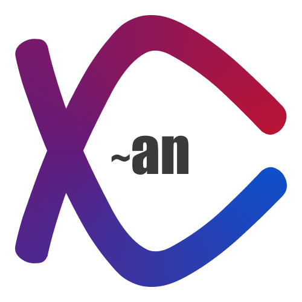

# xCan Ecosystem

**xCan Ecosystem** is a high-performance, all-in-one platform designed for modern artisans, agents, and digital creators. It empowers users to centralize their digital presence through custom link-in-bio pages, real-time stream overlays, and SEO-optimized developer blogs.

Built with a focus on speed, precision, and technical excellence, xCan leverages the full power of the **TALL Stack** and a modular **Bento-style** design philosophy.

---

## 🚀 Key Features

- **Link-in-Bio for Developers**: Highly customizable, zero-bloat profiles with integrated CSS control.
- **Live Stream Overlays**: Real-time data widgets for Twitch and YouTube, powered by Livewire for low-latency performance.
- **Developer Blogging**: Minimalist, MDX-supported blog platform with built-in code highlighting and SEO optimization.
- **Unified Administrative Dashboard**: Comprehensive data hub for managing links, analytics, and server health.
- **Modular Bento Suite**: A collection of executive-grade tools designed for speed and clarity.

## 🛠 Tech Stack

The xCan platform is built using the **TALL Stack**, ensuring seamless integration and developer-friendly workflows:

- **Tailwind CSS v4**: Utility-first CSS framework for rapid UI development and precise brand token management.
- **Alpine.js**: Lightweight JavaScript framework for interactive components like modals, dropdowns, and sidebar toggles.
- **Laravel**: Robust PHP framework providing the backbone for authentication, routing, and server-side logic.
- **Livewire**: Full-stack framework for building dynamic interfaces without leaving the comfort of Laravel.

## 🎨 Design System: xCan Core v4

The project adheres to the **xCan Core** design system, which emphasizes:

- **Typography**: _Geist_ for headlines and _Inter_ for body copy, paired with _JetBrains Mono_ for technical labels.
- **Color Palette**: A professional corporate scheme featuring **Royal Blue (#1218a6)** and **Crimson (#bb0017)**.
- **Visual Style**: Clean lines, measurable whitespace, and high-fidelity geometric components (inspired by architectural integrity).
- **Responsiveness**: Fluid transitions across mobile, tablet, and desktop devices.

---

## 📂 Project Structure

- `/landing-pages`: Various high-converting variants (Corporate, Bento Technical, Linktree-style).
- `/dashboard`: High-contrast administrative interfaces with advanced sidebar navigation.
- `/docs`: Unified documentation portal including a component library and interactive playground.
- `/branding`: High-fidelity SVG and raster assets for the xCan brand identity.

---

## 📈 Getting Started

_Note: This is a design-native implementation focusing on frontend fidelity._

1. **Clone the Identity**: Integrate `{{DATA:DESIGN_SYSTEM:DESIGN_SYSTEM_2}}` into your project.
2. **Explore Components**: Visit the [Design System Documentation]({{DATA:SCREEN:SCREEN_166}}) to view the visual library.
3. **Deploy**: Optimized for Laravel Cloud deployment.

---

_© 2024 xCan Ecosystem. Engineered for performance._
